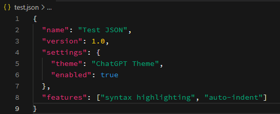

# ChatGPT Dark Theme for Visual Studio Code

📦 **ChatGPT Dark Theme** é um tema escuro para o Visual Studio Code inspirado na estética dos blocos de código exibidos pelo ChatGPT. O tema prioriza legibilidade e contraste, com cores otimizadas para diversas linguagens, incluindo JSON, PHP, JavaScript, HTML e CSS.

## Instalação

### Pelo Marketplace
1. Acesse o [ChatGPT Theme no Visual Studio Marketplace](https://marketplace.visualstudio.com/items?itemName=andregvg.chatgpt-vscode-theme)
2. Clique em Install.

### No VS Code:
1. Pressione `Ctrl+Shift+X` (ou `Cmd+Shift+X` no macOS) para abrir a aba de extensões.
2. Pesquise por "ChatGPT Dark Theme" e clique em Instalar.
2. Clique em Install

### Após a instalação:
1. Pressione `Ctrl+K Ctrl+T` (ou `Cmd+K Cmd+T` no macOS) para abrir o seletor de temas.
2. Navegue até `ChatGPT Dark Theme` e pressione `Enter` para aplicar.

### Instalação Manual (opcional)
1. Baixe o arquivo .vsix da extensão.
2. No terminal, execute:
```
code --install-extension caminho/para/o/arquivo.vsix
```
Obs: substitua caminho/para/o/arquivo.vsix pelo caminho completo do arquivo.

## Funcionalidades
- Tema escuro moderno e limpo
- Cores diferenciadas por linguagem (em expansão)
- Suporte inicial completo para arquivos JSON
- Estrutura em preparação para suportar PHP, JS, HTML e CSS
- Recomenda configurações ideais automaticamente

## JSON


## Configurações Aplicadas Automaticamente

Ao ativar este tema, o VS Code aplicará automaticamente as seguintes preferências (sem alterar permanentemente seu `settings.json`):

```json
"editor.bracketPairColorization.enabled": false,
"editor.fontFamily": "'Source Code Pro', monospace",
"editor.fontSize": 14,
"editor.lineHeight": 22
```

Essas configurações são aplicadas somente enquanto o tema estiver ativo.

## Recomendação de Fonte

Este tema utiliza a fonte **Source Code Pro** para melhor legibilidade. Se ela não estiver instalada no seu sistema, o VS Code usará uma fonte alternativa.

Baixe e instale gratuitamente: [Source Code Pro - Google Fonts](https://fonts.google.com/specimen/Source+Code+Pro)

## Remover a extensão

Para remover a extensão, execute:
```
code --uninstall-extension andregvg.chatgpt-vscode-theme
```

---
Se você curtiu esse tema, dê ⭐ no [GitHub](https://github.com/andregvg/chatgpt-vscode-theme) e deixe uma avaliação no Marketplace.

Consulte o [CHANGELOG](./CHANGELOG.md) para ver as mudanças recentes.
